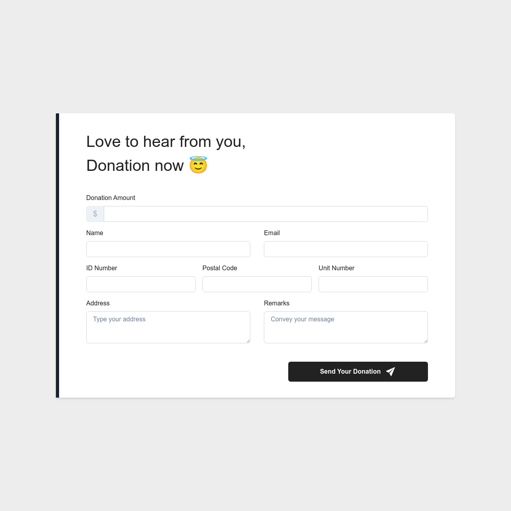

<!-- PROJECT LOGO -->
<br />
<div align="center">
  <h1 align="center">Example Form Validation</h1>

  <p align="center">
   this Application is a example for Form validation with a Yup + React Hook Form
    <br />
    <br />
    <a href="https://validation-app-sigma.vercel.app/">View Demo</a>
    ·
    <a href="https://github.com/mitro-ubaidillah/Validation-App/issues">Report Bug</a>
    ·
    <a href="https://github.com/mitro-ubaidillah/Validation-App/issues">Request Feature</a>
  </p>
</div>

<!-- ABOUT THE PROJECT -->
## About The Project



## YUP
Yup is a schema builder for runtime value parsing and validation. Define a schema, transform a value to match, assert the shape of an existing value, or both. Yup schema are extremely expressive and allow modeling complex, interdependent validations, or value transformation. [site](https://github.com/jquense/yup)

## React Hook Form
React Hook Form is a library that helps you validate forms in React. It is a minimal library without any other dependencies, while being performant and straightforward to use, requiring developers to write fewer lines of code than other form libraries. [site](https://react-hook-form.com/)


<p align="right">(<a href="#readme-top">back to top</a>)</p>

### Built With

This application is built using technology:

* [![React][React.js]][React-url]
* [![Vite][Vite.dev]][Vite-url]
* [![Chakra UI][Chakra]][ChakraUI-url]
* [![Vercel][Vercel]][Vercel-url]
* 

<p align="right">(<a href="#readme-top">back to top</a>)</p>


<!-- GETTING STARTED -->
## Getting Started


To run the Project locally, you can follow these steps:

### Prerequisites
You can download Node js to run this project
* Node JS
[download](https://nodejs.org/en/download/)  

### Installation

1. Clone the repo
   ```sh
   git clone https://github.com/mitro-ubaidillah/Validation-App.git
   ```
2. Install NPM packages
   ```sh
   npm install
   ```
3. Run Project
    ```
    npm run dev
    ```

<p align="right">(<a href="#readme-top">back to top</a>)</p>


<!-- USAGE EXAMPLES -->
## Usage

demo aplikasi

_For more examples, please refer to the [Documentation](https://validation-app-sigma.vercel.app/)_

<p align="right">(<a href="#readme-top">back to top</a>)</p>

<!-- LICENSE -->
## License

Distributed under the MIT License. See `LICENSE.txt` for more information.

<p align="right">(<a href="#readme-top">back to top</a>)</p>


<!-- CONTACT -->
## Contact

### Team

Muchamad Mitro Ubaidillah - ubaidillahmitro@gmail.com

[![Github][Github]][Github-Mitro-url]
[![LinkedIn][LinkedIn]][LinkedIn-mitro]

<p align="right">(<a href="#readme-top">back to top</a>)</p>


<!-- MARKDOWN LINKS & IMAGES -->
<!-- https://www.markdownguide.org/basic-syntax/#reference-style-links -->

[React.js]: https://img.shields.io/badge/React-20232A?style=for-the-badge&logo=react&logoColor=61DAFB
[React-url]: https://reactjs.org/
[Vite.dev]: https://img.shields.io/badge/vite-%23646CFF.svg?style=for-the-badge&logo=vite&logoColor=white
[Vite-url]: https://vitejs.dev/
[Redux]:https://img.shields.io/badge/redux-%23593d88.svg?style=for-the-badge&logo=redux&logoColor=white
[Redux-url]: https://redux.js.org/
[Chakra]: https://img.shields.io/badge/chakra-%234ED1C5.svg?style=for-the-badge&logo=chakraui&logoColor=white
[ChakraUI-url]:https://chakra-ui.com/
[TailwindCSS]: https://img.shields.io/badge/tailwindcss-%2338B2AC.svg?style=for-the-badge&logo=tailwind-css&logoColor=white
[TailwindCSS-url]:https://tailwindcss.com/
[Vercel]:https://img.shields.io/badge/vercel-%23000000.svg?style=for-the-badge&logo=vercel&logoColor=white
[Vercel-url]:https://img.shields.io/badge/vercel-%23000000.svg?style=for-the-badge&logo=vercel&logoColor=white
[Github-Mitro-Url]:https://github.com/mitro-ubaidillah
[Github]:https://img.shields.io/badge/github-%23121011.svg?style=for-the-badge&logo=github&logoColor=white
[LinkedIn]:https://img.shields.io/badge/linkedin-%230077B5.svg?style=for-the-badge&logo=linkedin&logoColor=white
[LinkedIn-mitro]:https://www.linkedin.com/in/muchamad-mitro-ubaidillah-4541a1150/
[Github-almira]:https://github.com/Almiramahsa
[LinkedIn-Almira]:https://www.linkedin.com/in/almira-mahsa
[Github-Hendry-url]:https://github.com/hendrywilliam
[LinkedIn-Hendry]:https://www.linkedin.com/in/hendri-william-tinambunan-4192431b5
